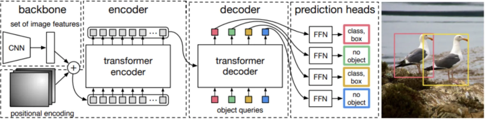
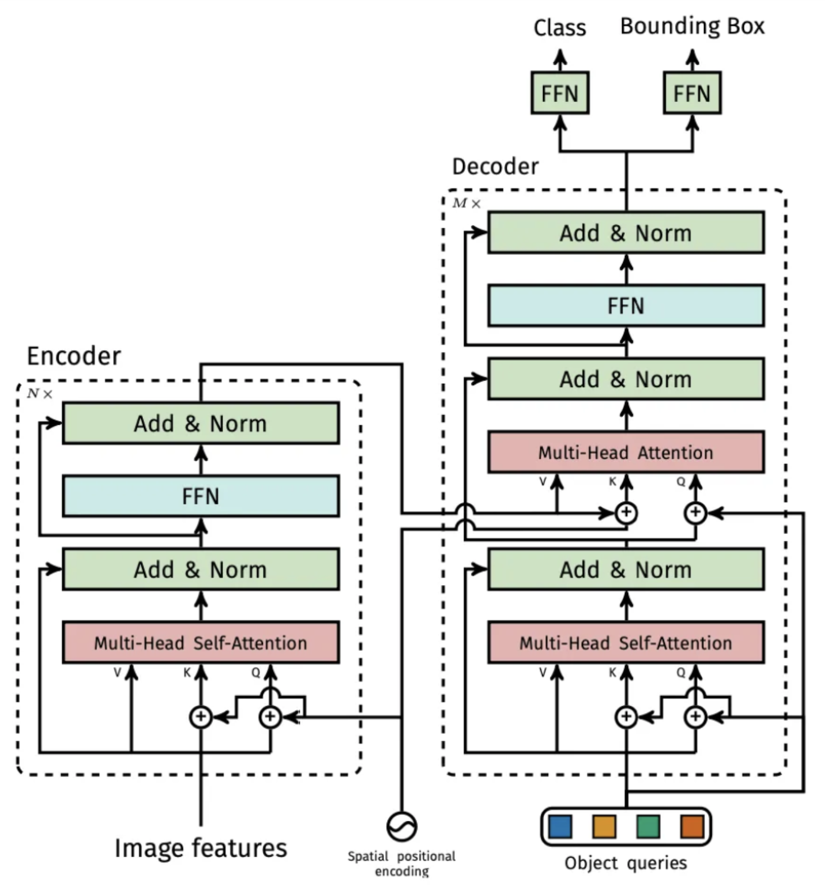
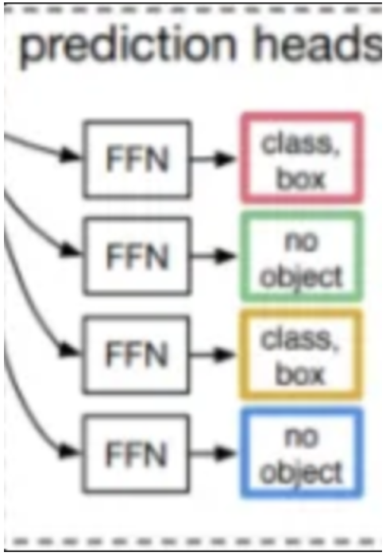

<aside>

# **0. Abstract**

</aside>

해당 논문에서는 객체탐지를 직접적인 예측 문제로 바라보는 새로운 관점을 제공합니다.
이러한 관점을 통해서 NMS, Anchor box generator와 같이 사람의 수동으로 설정하는 를 제거하였다고 합니다. ( 이는 결국 Inductive bais를 제거하였다고 생각된다 )

DETR의 주요 아이디어는 1) ***이분 매칭*** (bipartite matching)) 을 통해서 유일한 예측을 강제하는 집합 기반 손실을 사용하고 2) Tansformer의 Encoder-Decoder 아키텍처를 이용한다고 합니다.

추가로 학습된 ***소수 쿼리***를 활용하여 이미지의 전체적인 흐름과 객체간의 관계를 통해서 병렬적으로 예측을 실행한다고 합니다.

### Abstract 2줄 요약

객체탐지를 End to End로 수행하기 위해서 에측 문제의 관점으로 접근 하였고 이분매칭, Transformer의 구조를 활용하여 병렬적으로 수행하도록 유도하였다. #이분매칭 #소수쿼리

<aside>

# **1. Introduction**

</aside>

객체탐지의 목적은 결국 ( 박스의 좌표, 박스의 라벨 )의 집합을 예측하는 것 입니다. 
이전까지의 연구들에서는 이렇게 하나의 집합을 얻기 위해서 여러 단계를 거치도록 파이프라인을 설계하였습니다.
Surrogate regression + classification problem 을 통해서 하나의 집합을 구하였습니다.
( Surrogate : 대리의 의미로 최종 목표는 아니지만 직접 최종 목표를 이루기 어려운경우 Local goal 처럼 우회해서 최종 목표를 달성하기 위해서 사용 → OD에서는 RPN이 바로 Surrogate regression입니다 )

하지만 이러한 방식은 경험적 방법에 많이 영향을 미쳤습닏. NMS, Anchor 박스 등을 어떻게 설계하느냐에 따라서 성능에 많은 영향을 주었습니다. 
그리고 다른 분야에서 End-to-End 프로세스 철학이 많은 발전을 이루도록 하였습니다. 그래서 해당 논문에서는 객체 탐지 또한 End-to-End 로 구현하고자 하였습니다.

self attention과 같은 매커니즘을 활용하기 떄문에 객체간의 상호작용이 많아 집합의 중복을 최소화할 수 있어 자동으로 NMS를 적용하는 효과를 볼 수 있습니다. 해당 논문에서 주장하는 모델의 경우 [ bipartite matching loss + transformer with parallel decoding ] 이라고 볼 수 있습니다. 

그리고 추가로 해당 논문에서 해당 모델은 다른 모델들 보다 더 긴 학습 시간이 필요하며, 작은 객체에 대해서는 다소 낮은 정확도를 보여준다고 합니다. 그리고 Transformer의 보조 loss가 많은 도움이 된다고 합니다.

### Introduction 2줄 요약

surrogate regression을 사용하지 않고 집합관점에서 집합 Loss와 병렬적 Transformer의 인코더-디코더 아키텍처를 활용하여 Inductive bais를 최소화하는 모델을 개발하였다. 단, 학습시간이 오래걸리며 작은 객체는 잘 못잡는다.

---

<aside>

# 3. The DETR model

</aside>

> 해당 논문에서 직접 집합 예측을 위해서는 다음과 같은 2가지 요소가 필수적이라고 말하고 있습니다.
> 
1. 실제 박스와, 예측 박스를 강제로 유일하게 매칭하는 손실 함수. ( NMS를 하지 않아도됨 )
2. 한번의 패스로 객체 집합을 예측하고, 이들의 관계를 모델링하는 아키텍처

# ***3.1 Object detection set prediction loss***

한번의 패스로 객체를 탐지하는 과정에서 가장 어려운 것은 실제 값과 예측 값를 비교하는 손실 함수를 정의 하는 것입니다. 해당 논문에서는 총 N개의 객체를 모델이 예측하도록 합니다. 이때 N은 실제 객체의 갯수보다 훨씬 큰 수로 설정하게 됩니다. 그렇기 때문에 N개 중 NULL 값을 갖을 수도 있습니다. 그래서 N개 중에서 이분매칭을 통해서 손실함수가 작은 순으로 나열을 할 수 있게 됩니다.

$$
\sigma = \underset{\sigma \in S_N}{\operatorname{arg\,min}} \sum_{i=1}^{N} L_{\text{match}}(y_i, \hat{y}_{\sigma(i)})
$$

다음과 같이 이분매칭을 활용하게 됩니다. 이때 효율적인 비교를 위해서 Hungarian algorithm 을 활용한다고 합니다.

매칭 비용의 경우 단순히 박스의 위치만 비교하는 것이 아니라 $y_i = (c_i, b_i)$ 다음과 같이 ( 클래스, 박스 ) 비용을 모두 고려하게 됩니다. 클래스의 경우 해당 객체의 레이블이 할당되고, 박스 위치의 경우 각 박스에 상대적인 ( 중심x, 중심 y, 높이, 너비 ) 로 주어지게 됩니다 ( $b_i \in [0,1]^4$ ). 그리고 만일 객체가 없다고 판단되면 모두 NULL 값을 갖게 됩니다.

$$
L_{\text{match}}(y_i, \hat{y}{\sigma(i)}) = -1\{c_i \neq \varnothing\} \hat{p}{\sigma(i)}(c_i) + 1\{c_i \neq \varnothing\} L_{\text{box}}(b_i, b_{\sigma(i)})
$$

그리고 최종적으로 다음과 같이 손실 함수를 정의할 수 있게 됩니다. 

클래스 분류의 경우 해당 인덱스의 확률 값이 높은 경우 더 적은 손실을 제공하기 위해서 -1 을 곱하도록 하고, 박스 좌표의 경우 두 박스 사이의 차이는 그대로 손실에 반영하기 위해서 +1을 곱하도록 됩니다.

### Object Detection set prediction loss 전반부 2줄 요약

모델에서 출력된 N개의 예측 결과(클래스와 바운딩 박스)가 있고, 이를 실제 GT와의 모든 가능한 조합에 대해 비용 행렬을 구성한 뒤, Hungarian 알고리즘을 통해 전체 손실이 최소화되는 1:1 매칭을 찾아내는 과정이다.

위의 방식을 통해서 1대1로 예측값과 실제 값들이 매칭이 되게 됩니다. 이렇게 매칭 된 다음 흔히 사용되는 손실함수를 통해서 최종 손실을 구하게 됩니다.

$$
\mathcal{L}_{\text{Hungarian}}(y, \hat{y}) = \sum_{i=1}^{N} \left[-\log \hat{p}_{\hat{\sigma}(i)}(c_i) + 1\{c_i \neq \varnothing\} L_{\text{box}}(b_i, \hat{b}_{\hat{\sigma}(i)})\right]
$$

위의 수식이 최종 손실함수입니다. 클래스에 대해서는 Negative log liklihood를 사용하게 되고, 박스에 대해서는 객체인 경우에만 박스 손실을 적용하게 됩니다. 

**Notice** : 

***매칭 손실 단계*에서는:** 실제 객체가 아닌 경우, 박스 손실을 예측에 크게 영향을 주지 않도록 상수로 처리하여, 헝가리안 알고리즘이 1:1 매칭을 올바르게 수행하도록 유도합니다.

***최종 손실 단계*에서는:** 실제 객체에 대해서만 박스 손실을 계산하고, 객체가 아닌 경우에는 박스 손실을 0으로 처리하여, 모델이 실제 객체의 박스 예측에 집중할 수 있도록 합니다.

### Object Detection set prediction loss 후반부 2줄 요약

헝가리안 알고리즘을 통해서 실제 값과 매칭되는 예측값 쌍을 찾고, 그 쌍을 통해서 최종 손실을 적용하여 최종적인 모델의 손실을 구하게 됩니다. ( 각각 객체가 아닌 경우 처리하는 방식이 다릅니다 )

다른 객체 탐지 기법에서는 보통 anchor box나 초기 추정치(offset)를 사용하여, 예측된 박스와 실제 박스의 차이를 상대적으로 예측하도록 학습합니다. 예를 들어, “어느 방향으로 조금만 이동하면 더 가까워지겠다”는 식의 offset 예측을 통해 박스 좌표를 조정합니다.

반면, DETR에서는 anchor 없이 박스의 좌표를 직접 예측하며, 그 결과를 바로 비교합니다. 즉, DETR은

$$
\|b_i - b_{\sigma(i)}\|1
$$

*와 같은 ℓ1 손실을 사용하여 예측 박스  $b{\sigma(i)}$* 와 실제 박스 $b_i$ 사이의 절대 차이를 계산합니다.

하지만 ℓ1 손실만 사용할 경우, 큰 박스와 작은 박스의 상대적인 오차가 비슷하더라도, 절대적인 손실 크기에는 차이가 발생합니다. 예를 들어, 큰 객체의 경우 동일한 비율의 오차라도 절대적인 오차 값이 커지므로, 자연스럽게 큰 객체에 대해 더 큰 손실이 발생하게 됩니다.

이를 보완하기 위해, DETR은 ℓ1 손실과 함께 상대적인 크기를 고려할 수 있는 Generalized IoU (GIoU) 손실을 함께 사용합니다. GIoU 손실은 단순히 겹치는 영역(IoU)뿐 아니라, 박스의 위치와 크기 차이도 반영하여 scale-invariant한 평가를 제공하므로, 작은 박스와 큰 박스 모두에서 공정한 손실 계산이 가능합니다.

따라서, 최종적인 박스 손실은 아래와 같이 두 손실의 선형 결합으로 정의됩니다.

$$
L_{\text{box}}(b_i, b_{\sigma(i)}) = \lambda_{\text{iou}}\, L_{\text{iou}}(b_i, b_{\sigma(i)}) + \lambda_{L1} \, \|b_i - b_{\sigma(i)}\|_1
$$

여기서 $\lambda_{\text{iou}}와 \lambda_{L1}$ 는 각 손실 항의 중요도를 조절하는 하이퍼파라미터입니다.

즉, DETR은 직접적인 박스 좌표 예측 방식을 사용하면서도, ℓ1 손실의 절대적 스케일 문제를 Generalized IoU 손실을 추가하여 보완함으로써, 다양한 크기의 객체에 대해 균형 잡힌 손실 신호를 제공하려고 합니다.

### Object Detection set prediction loss - bounding box loss 2줄 요약

다른 OD 모델들이 offset을 학습하는 대신, DETR의 경우 직접적으로 좌표값을 비교합니다. 그리고 객체의 상대적인 크기를 고려하기 위해서 L1 Loss + Generalized IOU를 결합한 손실함수를 사용합니다.

---

# ***3.2 DETR architecture***

DETR은 매우 간단한 구조로 구성되어있습니다. 크게 3가지 모듈로 나누어 설명할 수 있는데 

1. CNN Backbone
2. Transformer Encoder-Deocder구조
3. FFN (Feed Forward Network )

### Backbone

간단하게 CNN 기반의 모델을 사용하며 해당 논문에서는 주로 C = 2048, W = $W_0 / 32$,  H = $H_0 / 32$ 값을 사용한다고 합니다. 

### Transformer

transformer의 경우 간단하게 transformer의 아키텍처를 그대로 사용하며, 입력의 경우 2048은 너무 고차원이기 떄문에 d차원으로 차원을 축소 한다음에 d X HW 크기의 2D 텐서로 변경해서 seqence 입력으로 사용한다고 합니다. 

주의 깊기 봐야하는 포인트는 Object queries가 포함된 decoder와 prediction head 부분을 주의깊게 봐야 DETR에 대해 이해할 수 있을것 같습니다.

> 흐름 : 입력으로는 이미지의 Feature map이 들어오게 됩니다. 그리고 이미지의 feature map을 통해서 Encoder에서 이미지의 전체적인 문맥을 파악하게 됩니다. 그리고 Deocder의 입력으로는 무작위로 초기화된 N개의 입력이 들어오고 그들 끼리 attention을 진행하게 됩니다. 그리고 그 이후 Encoder Deocder attention을 통해서 문맥 정보가 담겨지고 최종적으로 각각의 FFN통해서 N개의 클래스 정보과 박스 정보가 나오게 됩니다.
> 

object queries의 경우 N개의 d차원의 벡터이고, 랜덤으로 초기화가 되어있습니다. 특히 랜덤으로 초기화가 되는 경우 서로 중복되는 queries가 없도록 설정됩니다. DETR의 경우 non-autoregressive하기 때문에 만일 동일한 queries가 들어오게 되면 동일한 결과가 나오기 떄문입니다. 그래서 랜덤으로 초기화된 서로다른 N개의 벡터가 Decodder를 통해서 각각의 객체를 표현하도록 유도되게 됩니다.

### Prediction feed-forward networks ( FFNs )

FFN의 경우 2개의 브랜치로 나뉘어집니다. 하나는 3계층으로 구성된 MLP 층이며, 해당 층에서는 정규화된 박스의 중심, 너비, 높이를 예측하게 됩니다. 그리고 다른 하나는 1계층의 선형 레이어이며 softmax를 통해서 클래스의 라벨을 예측하게 됩니다. 그리고 객체가 없다는 것을 표현하는 $\varnothing$ 은 일종의 배경으로 처리가 되게 됩니다.

### Auxiliary decoding losses

별도의 보조 손실을 각 Decode 레이어 마다 추가로 예측 FFN과 Hungarian loss를 연결하게 됩니다. 이를 통해서 각 Decode 마다 각각의 예측을 수행하고 backpropagation을 통해서 각 Decoder가 더 안정적으로 학습을 할 수 있도록 유도합니다. 이를 통해서 추가의 연산량이 필요하지만 모든 예측 FFN등을 공유되며, 안정적 학습을 통해 모델의 수렴 속도가 향상되어 학습시 추가로 많은 시간을 필요로 하지 않는다고 합니다.

### DETR architecture 2줄 요약

DETR의 경우 Backbone + Transformer + FFN 구조로 구성되어있습니다. 그리고 Transfrormer의 Decoder에서는 object queries가 존재하여 N개의 서로 다른 객체를 예측하도록 유도하게 됩니다.

---

# Technical details

- 최적화 :
Optimizer : AdamW
LR : $10^{-4}$
weight decay : $10^{-4}$
- 초기화 : Xavier
- Backbone : ResNet
- Improve resolution : dilation
- Augmentation :  
    scaling
    Random crop ( 0.5확률로 랜덤으로 직사각형 형태로 크롬 진행 )
- Dropout : 0.1

# 나의 정리

DETR의 경우 객체 탐지 분야에 Transformer를 적용함으로 써 복잡한 파이프라인을 간단한 구조로 변경하여 높은 정확도를 보여준 모델입니다. DETR의 가장 핵심 관점은 바로 객체 탐지를 이분 매칭 예측 문제로 치환한 것이라고 생각합니다. 그리고 이를 학습할 수 있는 Matching Loss, Hungarian Loss를 도입하였다는 것입니다. 이를 통해서 매우 간단한 구조를 통해서 객체 탐지를 End-to-End로 구현할 수 있게 되었습니다.